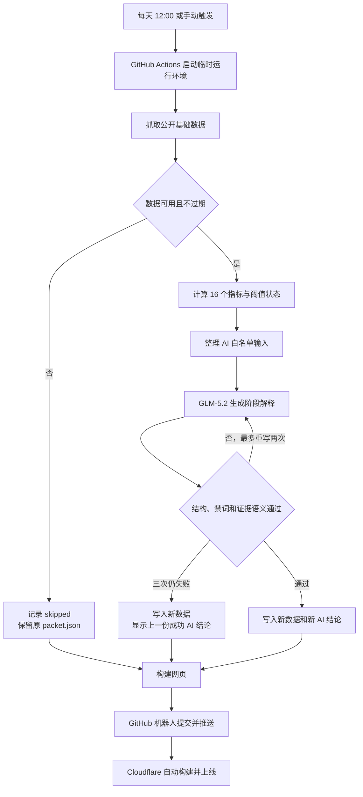

# 每日自动更新机制

状态：已上线  
执行时间：每天北京时间 12:00  
线上地址：[btc-bear-market-dashboard.erwinwu000.workers.dev](https://btc-bear-market-dashboard.erwinwu000.workers.dev/)

## 一句话说明

GitHub Actions 每天启动一台临时运行环境，抓取公开数据、计算 16 个指标、调用 GLM-5.2 生成阶段解释，再把通过校验的数据包提交到 `main`。Cloudflare 发现新提交后重建网站。

定时更新不依赖个人电脑。电脑关机不会影响任务。

## 整体流程



## 各模块负责什么

| 职责 | 文件 | 说明 |
|---|---|---|
| 定时启动 | [`.github/workflows/daily-update.yml`](../../.github/workflows/daily-update.yml) | 设置北京时间 12:00、手动触发、20 分钟上限和写入权限。 |
| 主流程 | [`services/run_daily.py`](../../services/run_daily.py) | 串起抓取、计算、AI、回退、数据包写入和运行日志。 |
| 数据抓取与计算 | [`services/data/`](../../services/data/) | 抓取公开基础序列，计算 16 个指标、图表数据和当前阈值状态。 |
| AI 输入边界 | [`services/ai/input_builder.py`](../../services/ai/input_builder.py) | 只发送阶段定义、类别、指标角色、当前值和阈值，不发送完整历史曲线。 |
| AI 调用 | [`services/ai/provider.py`](../../services/ai/provider.py) | 调用 GLM-5.2，要求输出固定 JSON，失败时最多生成三次。 |
| AI 校验 | [`services/ai/validator.py`](../../services/ai/validator.py) · [`semantic_validator.py`](../../services/ai/semantic_validator.py) | 检查字段、固定词汇、禁词、阈值触发关系和已知指标含义。 |
| 数据包 | [`services/data/packet.py`](../../services/data/packet.py) | 组装并校验 `packet.json`，通过临时文件加替换操作完成原子写入。 |
| 审计日志 | [`artifacts/run-log.jsonl`](../../artifacts/run-log.jsonl) | 每次运行记录 `run_id`、日期、结果、阶段和失败原因。 |

## 一次更新具体做什么

### 1. GitHub 按北京时间启动

工作流使用以下配置：

```yaml
schedule:
  - cron: '0 12 * * *'
    timezone: "Asia/Shanghai"
```

GitHub 的共享运行队列可能让任务晚几分钟开始。`workflow_dispatch` 提供手动运行入口。`concurrency` 阻止两次日更同时修改数据，后启动的任务会等待前一项结束。

### 2. 抓取数据并检查日期

主流程抓取 Bitview 与 OBM 的公开序列，然后计算价格、16 个指标和两组柱状数据。

系统用所有必要序列的共同日期作为 `data_date`。数据比运行日期落后超过 2 天时，系统记录 `skipped`，不替换现有 `packet.json`。

### 3. 只把当前证据发给 AI

AI 不读取整个网页，也不读取历史曲线。`input_builder.py` 只发送：

- 固定市场阶段及其定义；
- 六个证据类别；
- 16 个指标的当前值、核心或辅助角色；
- 每个触发阈值的方向、数值和含义。

图表中只用于观看的中性参考线不会进入 AI 的触发阈值清单。

### 4. GLM-5.2 生成结构化解释

当前参数如下：

| 项目 | 当前值 |
|---|---|
| 模型 | `glm-5.2` |
| 推理强度 | `high` |
| 单次等待上限 | 300 秒 |
| 最大输出 | 4096 tokens |
| 最多生成次数 | 3 次 |
| 输出格式 | 单个 JSON 对象 |

AI 只能从固定阶段中选一个，并给出一致性、六类状态、支持证据、阻碍和下一阶段条件。它不能提供交易建议、价格预测或概率。

### 5. 程序重新检查 AI

AI 返回 JSON 后，程序执行两层检查。

第一层检查结构和用词：

- 阶段、类别和一致性必须使用固定词汇；
- 六个类别必须完整且不重复；
- 必填说明不能缺失；
- 文本不能包含交易、仓位、杠杆或概率用语。

第二层把文字重新对照当天指标：

- 支持证据只能引用已经触发阈值的指标；
- 某类别没有任何指标触发时，状态只能是“未确认”；
- 未触发指标只能放在阻碍、反面证据或待确认条件中；
- 程序拦截 Reserve Risk、HODLer 零线等已知含义反转。

校验失败时，程序把具体原因交给 AI 重写。第三次仍不合格时，系统不发布这份 AI 文字。

### 6. 写入一个网页数据包

网页只读取：

```text
dashboard/public/data/packet.json
```

这个文件包含当前快照、图表序列、AI 解释、日期、`run_id` 和运行状态。程序先校验完整数据包，再写入临时文件，最后用一次替换操作更新正式文件。网页不会读到只写了一半的 JSON。

### 7. 构建、提交和部署

GitHub Actions 运行：

```bash
cd dashboard
npm ci
npm run build
```

构建通过后，`github-actions[bot]` 只提交两个文件：

```text
dashboard/public/data/packet.json
artifacts/run-log.jsonl
```

机器人把提交推送到 `main`。Cloudflare 的 Git 集成检测到新提交，构建静态网页并更新同一个公开地址。

## 失败时网站会怎样

| 情况 | 运行结果 | `packet.json` | 用户看到什么 |
|---|---|---|---|
| 数据源失败或数据过期 | `skipped` | 保持不变 | 上一次线上数据与结论 |
| AI 超时、接口断开或三次输出仍不合格 | `published-fallback` | 写入本次数据，`analysis=null`，保留上一份成功解释到 `fallback` | 页面提示今日 AI 不可用，并显示上一份成功解释 |
| 数据、AI 和数据包全部通过 | `published-fresh` | 写入本次数据和本次解释 | 当天数据与当天 AI 结论 |
| 网页构建失败 | GitHub Actions 失败 | 仓库不产生新提交 | Cloudflare 继续提供上一版网站 |
| Cloudflare 构建失败 | Cloudflare 显示失败 | GitHub 已有新提交 | 公开地址继续提供上一次成功部署 |

当前代码在 AI 失败时回退的是“AI 解释”，不是整份旧数据包。图表数据可以是本次数据，页面会用 `today_available=false` 标明 AI 解释来自上一次成功运行。

## 密钥和权限

智谱 API Key 存在 GitHub Secret `AI_API_KEY` 中。工作流把它作为进程环境变量交给 Python，不把它写入数据包、运行日志或终端输出。

工作流只申请 `contents: write` 权限，用于让 GitHub 机器人提交日更数据。Cloudflare 凭据不进入日更脚本，Cloudflare 通过 GitHub 仓库集成读取新提交。

## 查看一次运行是否成功

可以从三个位置核对：

1. GitHub 仓库的 `Actions > daily-update` 查看任务是否成功。
2. [`artifacts/run-log.jsonl`](../../artifacts/run-log.jsonl) 查看 `published-fresh`、`published-fallback` 或 `skipped`。
3. 打开线上 [`/data/packet.json`](https://btc-bear-market-dashboard.erwinwu000.workers.dev/data/packet.json)，检查：

```text
run_id
data_date
analysis_date
status.today_available
status.last_success_date
status.reason
```

## 手动运行

线上手动运行：

```text
GitHub > Actions > daily-update > Run workflow
```

本地测试完整链路但不调用真实 AI：

```powershell
python services/run_daily.py --mock-ai
```

本地调用真实 AI：

```powershell
$env:AI_API_KEY = "<your-key>"
python services/run_daily.py
```

不要把 API Key 写入仓库文件。

## 验收入口

```powershell
python tests/acceptance/run_acceptance.py
```

该入口覆盖日程配置、AI 输入边界、失败重试、证据语义、完整数据包、回退状态和浏览器展示。2026-07-28 的记录为 `57 passed + ACCEPTANCE PASS`。

