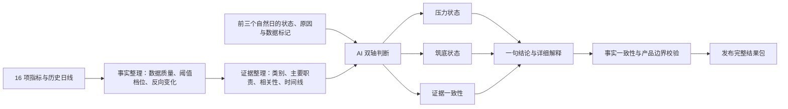

# v0.4.0 — 双轴熊底状态模型设计

> 状态：核心产品决策与书面规格已于 2026-07-29 获用户确认；实施计划阶段已启动。本文只定义新版状态规划，尚未修改代码、阈值、数据源、公开页面或线上版本。

## 当前进度

- 已完成：双轴市场状态、证据职责、人工校准档位保护、前三天上下文、修复与离开窗口、AI 与机器边界及页面解释结构已经确认。
- 当前状态：完整实施规格已完成自审，并发布为 [GitHub Issue #2](https://github.com/DrErwin/btc-bear-market-dashboard/issues/2)，标签为 `ready-for-agent`。
- 待办：等待用户审阅实施规格并确认是否进入实施阶段。
- 下一步：规格获用户确认后，从“契约与固定验收场景”开始实施；确认前不修改运行逻辑。

## 1. 一句话决策

熊底不再被表达成一个需要猜中的时刻，也不再被压缩成一条只能向前的五阶段进度条。

新版看板把熊底理解为一段可能反复的市场过程，同时回答两个不同问题：

1. 当前市场承受多深的压力；
2. 近期熊底证据已经形成到什么程度。

AI 直接判断这两条状态，并说明证据如何组合。机器负责整理可靠事实、保护数据边界和检查明显矛盾，不再用详细规则表预先算出 AI 必须选择的答案。

## 2. 为什么需要重做

### 2.1 旧五阶段混合了三种不同含义

旧词汇同时包含：

- 市场方向，例如“熊市下行期”；
- 压力程度，例如“深度压力期”；
- 证据完整度，例如“筑底证据积累期”。

这三种含义不是同一把尺子，不能稳定地排列成一条单向路线。

### 2.2 不同指标处在不同档位是正常现象

同一天可能同时出现：

- 某个估值指标进入极端档；
- 某个矿工指标只进入观察档；
- 某个持有者指标尚未出现；
- 某个资本指标已经开始修复。

这不是数据冲突，而是熊底过程本来就由不同速度、不同职责的证据共同组成。产品应该解释这种组合，而不是强迫所有指标对齐到同一个阶段。

### 2.3 当日快照容易把过程误读成时刻

只看当天是否触发阈值，无法区分：

- 熊底过程尚未开始；
- 熊底过程正在形成；
- 短暂反弹后仍在底部窗口；
- 熊底过程已经结束，市场正在修复。

因此新版判断必须加入近期证据时间线和前三天状态上下文。

## 3. 产品目标与边界

### 3.1 目标

- 让普通用户一眼看懂当前压力深度和筑底进程；
- 容纳不同指标不同步、反复触发和反向变化；
- 保留用户人工回测形成的三档阈值成果；
- 让 AI 真正承担综合判断，而不是只改写机器答案；
- 同时限制 AI 不能编造事实、重复计算相关指标或自由扩展产品范围；
- 从进入底部观察一直覆盖到修复并离开底部窗口。

### 3.2 不做

- 不预测精确最低点；
- 不输出成功概率、价格目标、仓位、杠杆或买卖时机；
- 不在公开页面显示“定投、抄底、大力抄底”；
- 不在本版重新优化数值阈值；
- 不新增指标；
- 不把完整历史曲线直接发送给 AI；
- 不用分数表或固定组合公式替代 AI 判断。

## 4. 备选方案与选择

| 方案 | 做法 | 优点 | 主要问题 | 结论 |
|---|---|---|---|---|
| A. 继续单轴 | 只给旧五阶段改名 | 改动最小 | 仍然混合方向、压力和证据完整度，无法表达多种组合 | 不采用 |
| B. 双轴规则制 | 分成两条轴，但由机器用详细条件表计算 | 结果稳定、容易复现 | AI 只剩文案作用；规则会随组合增加而迅速膨胀 | 不采用 |
| C. 双轴 AI 框架制 | 机器整理事实与边界，AI 在固定框架内判断两条轴 | 能表达复杂组合，同时保留可控性 | 需要更好的事实校验、连续性和解释验收 | **采用** |

## 5. 面向用户的状态模型

### 5.1 压力轴

压力轴回答：“当前市场承受多深的压力？”

| 固定状态 | 面向普通用户的含义 |
|---|---|
| 压力尚未明显 | 多数有效证据尚未显示明显的熊市压力环境。 |
| 进入观察 | 部分压力证据已经出现，市场进入需要持续观察的区域。 |
| 深度压力 | 多类重要压力证据明显，市场内部承压较深。 |
| 极端压力 | 多类重要证据共同显示罕见或极端的市场压力。 |
| 数据不足 | 当前有效数据不足以可靠判断压力状态。 |

AI 必须从固定词汇中选择一个状态，但没有“某个指标触发就自动等于整体状态”的硬规则。

### 5.2 筑底轴

筑底轴回答：“近期熊底证据已经形成到什么程度？”

| 固定状态 | 面向普通用户的含义 |
|---|---|
| 未见筑底结构 | 当前主要只是市场波动或压力，尚未形成有意义的筑底线索组合。 |
| 筑底线索出现 | 少数相关证据已经出现，但仍然零散，重要矛盾或缺口较多。 |
| 筑底证据聚合 | 多类独立证据在近期陆续出现，正在形成更完整的组合。 |
| 筑底证据较完整 | 压力、投降、耗竭、承接或稳定等证据形成较完整结构，但不代表精确最低点。 |
| 市场修复中 | 部分压力正在减轻，修复类证据开始占据主导，但仍可能重新回到底部窗口。 |
| 已离开底部窗口 | 修复证据持续存在，当前判断重点不再是熊底形成。 |
| 数据不足 | 缺少近期时间线或关键证据，无法可靠判断筑底进程。 |

这些状态描述当前证据结构，不是必须依次走完的机械步骤。状态可以增强、减弱或回退。

### 5.3 证据一致性

证据一致性说明不同证据类别是否朝着相同方向，不是成功概率，也不是第三条市场轴。

| 固定状态 | 含义 |
|---|---|
| 弱 | 证据零散、互相冲突，或关键数据缺口较大。 |
| 中等 | 主要方向已经出现，但仍有明显反面或未完成证据。 |
| 强 | 多个相对独立的证据类别方向一致，重要反面证据较少。 |

### 5.4 不再生成第三个总体阶段

页面不再把两条轴重新压缩成一个“当前市场阶段”。首屏直接显示：

> 整体压力：深度压力；筑底状态：筑底证据聚合；证据一致性：中等。

AI 再用一句普通语言解释三者合在一起说明什么。

### 5.5 两条轴可以分别数据不足

压力轴与筑底轴需要的证据不同，因此可以出现：

> 整体压力：深度压力；筑底状态：数据不足。

某一条轴数据不足时，不必隐藏另一条仍然可靠的结论。两条轴都无法判断时，页面才显示整体数据不足。

证据一致性只在仍有足够有效证据可比较时显示。两条轴都为数据不足时，不再额外显示“弱／中等／强”，避免把缺少数据误写成证据冲突。

### 5.6 状态不是单向进度条

新版页面删除“已通过、当前、待观察”式单向表达。熊底过程可能出现：

> 压力加深 → 短暂减弱 → 再次下探 → 证据重新增强 → 修复失败 → 再次回到底部窗口

状态变化必须忠实反映当前证据，而不是因为曾经进入过某个状态就永久保留。

## 6. 指标阈值与人工校准成果

### 6.1 保留三档判断，不改变数值

用户通过人工回看历史熊市，将指标阈值分为：

- 观察档；
- 深度压力档；
- 极端压力档。

这些档位原本对应用户内部的定投、抄底和大力抄底研究用途。新版必须保留档位顺序、数值、方向和历史校准含义，不得因为修改页面文案而改变判断结果。

### 6.2 档位身份与显示文字分离

当前实现会从中文名称中的“观察、深度、极端”等词推断档位。新版不得继续依赖中文文字做判断。

每条阈值必须分别保存：

- 稳定的人工校准档位；
- 面向用户的档位名称；
- 该指标在此阈值下的事实含义；
- 数值、方向和数据日期；
- 内部校准来源说明。

例如：

> 深度压力：MVRV 已低于 0.8，市场价值显著低于链上成本。

修改第二行的解释文字，不得改变第一行的档位身份、页面颜色、证据时间线或 AI 输入含义。

### 6.3 行动对应关系只作内部记录

“定投、抄底、大力抄底”可以保留在内部校准记录中，用于追溯用户为什么设置三档阈值，但必须：

- 不进入公开页面；
- 不进入 AI 市场判断输入；
- 不出现在 AI 输出；
- 不被转换成交易建议。

AI 只需要知道人工校准档位的严重程度和指标事实含义。

## 7. 证据类别与主要判断职责

### 7.1 两种信息解决两个问题

每个指标同时保留：

- **证据类别**：说明它观察市场的哪个方面，并帮助识别相关指标；
- **主要判断职责**：说明它在熊底过程中主要帮助 AI 理解什么。

一个指标只有一个主要职责。反向变化可以提供修复说明，但不能让同一指标在同一天被重复计算成多份独立证据。

原有“核心锚、核心复核、强辅助、辅助”等重要性信息可以继续提供给 AI，但只用于理解证据地位，不再由机器据此设定阶段上限。

### 7.2 16 项指标的初始职责映射

| 指标 | 保留的证据类别 | 主要判断职责 | AI 使用边界 |
|---|---|---|---|
| MVRV | 估值 | 全市场估值压力 | 与 AVIV 属同一估值家族；反向变化可说明成本位置修复。 |
| AVIV | 估值 | 估值压力复核 | 复核 MVRV，不作为第二份独立估值证据。 |
| STH-MVRV | 恢复与承接 | 短期持有者修复与承接 | 低档位可解释短期压力，成本位置收复可提供修复说明。 |
| PSIP | 供应亏损 | 亏损供应覆盖面 | 与 SIPL、RUP、RUL 存在相关性，不按指标数量累加。 |
| SIPL | 供应亏损 | 盈利与亏损供应结构 | 与 PSIP 高度同源，主要用于交叉解释。 |
| Relative Unrealized Profit | 供应亏损 | 未实现盈利压缩 | 说明压力环境，不独立确认熊底。 |
| RUL · 4年 z-score | 供应亏损 | 极端未实现亏损与投降压力 | 项目自定义标准化，作为强度说明而非精确计时器。 |
| Realized Cap Relative NPC · 30d | 恢复与承接 | 资本收缩、稳定与承接 | 方向改善可以提供修复证据，不单独宣布离开窗口。 |
| aSOPR | 已实现亏损 | 亏损卖出与投降 | 反复触发较常见；亏损卖出减弱可补充修复判断。 |
| HODLer NPC · 30d | 持有者行为 | 长期持有者卖出或积累变化 | 数据不新鲜时只展示；恢复新鲜后仍作为辅助解释。 |
| ≥155d 花费价值占比 | 持有者行为 | 老币活动与投降背景 | 老币活动含义依赖市场环境，不能单独判断方向。 |
| Seller Exhaustion Constant | 卖方耗竭 | 卖方力量是否接近耗竭 | 当前阈值仍是项目校准，作为重要辅助而非机器硬门槛。 |
| Puell Multiple | 矿工压力 | 矿工收入压力 | 提供与投资者估值不同的压力视角，但不单独确认熊底。 |
| Thermocap Multiple · 周期 | 矿工压力 | 长期矿工估值背景 | 主要补充长期背景，不作为底部计时器。 |
| CVDD 接近程度 | 长期锚点 | 长期底部接近背景 | 当前规则待验证时不得作为有效判断证据。 |
| Reserve Risk · 周期 | 长期锚点 | 长期价值与持币信念环境 | 低位可能持续较久，适合作为背景而非时点信号。 |

这张表是新版 AI 阅读框架，不是“出现哪个指标就进入哪个状态”的规则表。

## 8. 证据时间线

### 8.1 机器整理事实，AI 理解过程

AI 不接收完整历史曲线。机器为每项有效指标和每个证据类别整理一份有界摘要，至少包含：

- 当前人工校准档位；
- 本轮近期首次进入该档位的日期；
- 最近一次进入或退出的日期；
- 持续时间与反复出现情况；
- 近期增强、减弱、退出或反向变化；
- 当前数据日期、新鲜度和不可用原因；
- 相关指标的合并说明，避免重复理解。

时间线只描述发生了什么，不输出市场状态答案。

### 8.2 前三天状态上下文

每日 AI 输入包含前三个自然日的：

- 两条状态；
- 证据一致性；
- 每天一条主要判断依据；
- 数据不足或旧结果标记。

前三天只用于连续性参考：

- 不进行多数投票；
- 不要求连续三天后才能升级或降级；
- 不阻止 AI 根据新事实立即改变状态；
- 不把旧结果伪装成今天的新判断。

### 8.3 状态变化原因

当任一状态变化时，AI 必须用一句普通语言说明最主要的证据变化。原因可以是：

- 新证据出现；
- 原有证据增强或持续；
- 关键证据消失；
- 反面证据增加；
- 修复证据持续；
- 数据质量变化。

不要求写成长篇日报，也不允许只说“综合判断发生变化”。

### 8.4 时间范围的实施门槛

本产品设计不凭主观感觉指定统一的历史回看天数。实施前必须用历史熊市案例比较不同时间范围，选择能够覆盖完整底部过程、又不会长期保留失效证据的范围。

无论最终选择多少天，都必须满足：

- AI 只接收摘要，不接收完整曲线；
- 摘要明确给出事件日期和持续时间；
- 超出有效范围的旧证据不能继续支持当前筑底状态；
- 时间范围调整不得改变用户人工校准的数值阈值。

## 9. 修复与离开底部窗口

### 9.1 不新增指标，先利用反向变化

现有三档阈值主要描述压力加深。新版先从同一批指标的反向变化中整理修复证据，例如：

- 退出原有压力档位并持续；
- 估值重新接近或站回成本位置；
- 亏损卖出减弱；
- 资本收缩停止或改善；
- 持有者行为由卖出转向积累；
- 多类压力证据不再同步增强。

这些只是提供给 AI 的修复事实，不设置“出现某一项就必须进入市场修复中”的硬规则。

### 9.2 压力减轻不等于已经修复

AI 必须区分：

- 一天或几天的短暂减压；
- 多类证据共同改善；
- 修复失败后重新进入底部窗口；
- 修复持续并逐步离开底部窗口。

“已离开底部窗口”必须有持续的修复解释，不能只因为某个压力指标当日退出阈值就得出。

## 10. AI 与机器的职责边界

### 10.1 机器负责

- 数据是否缺失、过期或待验证；
- 当前值与阈值的比较；
- 人工校准档位身份；
- 证据类别、主要职责和相关性说明；
- 证据时间线摘要；
- 前三天状态上下文；
- 固定输出词汇与必填解释结构；
- 检查 AI 是否引用了真实、有效、方向正确的证据；
- 拒绝交易建议、价格、仓位、杠杆和概率表达。

### 10.2 AI 负责

- 分别选择压力状态和筑底状态；
- 判断证据一致性；
- 权衡支持、反面、缺失和过期证据；
- 理解不同证据出现的先后、持续和反复；
- 判断短暂减压、修复中或离开底部窗口；
- 解释为什么选择当前状态；
- 说明相比前三天发生了什么变化；
- 给出下一步需要观察的市场证据。

### 10.3 不再保留详细阶段规则

v0.4.0 不再使用以下方式预先决定答案：

- `A + B = 某一阶段` 的固定组合表；
- 指标计数或加权总分；
- 机器生成的一两个“允许阶段”；
- 核心指标直接决定整体阶段上限；
- 辅助指标只能在机器限定范围内解释。

固定词汇、数据质量和事实一致性仍是硬边界；证据权衡和最终状态选择交给 AI。

## 11. AI 输出与页面信息结构

### 11.1 快速结论

首屏必须显示：

- 整体压力状态；
- 筑底状态；
- 证据一致性；
- 一句综合解释；
- 相比前三天是否变化；
- 状态变化时的一句原因。

首屏不逐项复述 16 个指标，不显示公式，不重复指标卡片中的数值。

### 11.2 可展开的详细解释

详细解释固定为六部分：

1. **为什么是当前压力状态**：综合不同类别的压力证据，并说明为什么不是更浅或更深。

2. **为什么是当前筑底状态**：说明近期哪些投降、耗竭、积累、承接或稳定证据正在形成组合。

3. **证据时间线**：说明哪些证据较早出现、刚刚出现、持续存在、反复出现或已经消失。

4. **反面证据与数据缺口**：说明哪些有效指标不同意当前结论，以及哪些数据缺失、过期或待验证。

5. **修复与离开窗口的判断**：区分短暂减压、持续修复和已经离开底部窗口。

6. **下一步观察重点**：只说明需要继续观察哪些市场证据变化，不提供用户行动建议。

### 11.3 指标区继续承担事实证明

指标卡片和图表继续展示：

- 当前值与日期；
- 人工校准档位；
- 该档位的指标事实解释；
- 数值阈值与方向；
- 数据质量；
- 历史曲线和参考线。

AI 解释负责说明“这些事实合在一起意味着什么”，指标区负责让用户核对事实依据。

## 12. 数据不足、失败与旧结果

- 压力轴和筑底轴分别判断数据是否足够；
- 数据是否足够由机器根据覆盖范围、新鲜度和时间线完整性判断，只约束“能不能判断”，不预先决定市场状态；
- 缺失或过期指标不能被当成“没有压力”或反面证据；
- 待验证指标可以展示，但不能被 AI 当成有效当前证据；
- AI 输出引用未触发、方向相反或过期证据时必须判定失败；
- 每日运行失败时继续展示上一份完整成功结果，并明确标出结果日期；
- 旧结果不能进入“前三天状态”时伪装成当天的新判断；
- 如果某条轴数据不足，详细解释必须说清缺少什么，而不是补写猜测。

## 13. 每日判断流程

## 14. 与现有版本的关系

- v0.2.4 的图表、参考线和交互不因本设计自动改变；
- v0.3.1 的统一阈值来源和人工校准三档继续保留；
- v0.3.0 的数据质量、证据类别、相关性和指标重要性可以复用；
- v0.3.0 的单一五阶段、`allowed_stages`、阶段上限和固定组合表由 v0.4.0 设计取代；
- 在 v0.4.0 真正实现、验收和发布前，现有运行代码仍按旧契约工作；
- 后续实施必须同步更新仓库中的产品约束说明，不能让旧 `allowed_stages` 指南与新版 AI 职责同时存在。

## 15. 验收场景

新版至少覆盖以下固定场景，并核对实际数值、阈值方向、时间线和 AI 文字是否一致：

1. 单个指标进入极端档，但其他类别不足，整体压力不得机械跟随单项指标；
2. 多类压力很深，但没有耗竭、承接或修复证据，不能把“很痛苦”直接写成“筑底证据较完整”；
3. 多类独立筑底证据在不同日期陆续出现，AI 能解释为过程而非同日触发；
4. 压力短暂减轻后再次增强，状态可以回退；
5. 修复证据持续出现，AI 能从筑底状态过渡到市场修复中；
6. 压力轴数据充分、筑底时间线不足，只把筑底轴标为数据不足；
7. 前三天状态相同但今天出现重要新事实，AI 可以立即改变状态并说明原因；
8. 前三天状态不同但今天证据没有变化，AI 不得因为多数票机械改变状态；
9. 修改阈值显示文字后，人工校准档位、触发结果、颜色和 AI 事实不得改变；
10. AI 引用未触发、方向错误、过期或待验证指标时必须失败；
11. AI 详细解释包含六部分，但不逐项复述 16 个指标；
12. 所有公开文字均不包含定投、抄底、大力抄底、仓位、杠杆、目标价或概率建议。

## 16. 成功标准

当用户看到页面时，应能回答：

1. 当前市场压力有多深；
2. 熊底证据是尚未形成、正在聚合、较完整，还是已经进入修复；
3. 为什么 AI 这样判断；
4. 哪些证据支持，哪些证据反对或缺失；
5. 相比前三天发生了什么；
6. 接下来应继续观察哪些市场证据。

同时，用户不应被引导去寻找某一天的精确最低点，也不应从页面获得交易动作、仓位或价格建议。

## 17. 后续工作边界

本文获得书面评审后，下一步只能先编写实施计划。实施计划需要单独拆分：

1. 状态与 AI 输出契约；
2. 人工校准档位身份与显示文案解耦；
3. 证据时间线摘要与历史范围验证；
4. 16 项指标职责和反向修复事实；
5. 前三天连续性输入；
6. AI 事实校验与固定验收场景；
7. 页面双轴结论和详细解释；
8. 旧单阶段契约迁移与发布验证。

在实施计划获批前，不修改当前运行逻辑。
